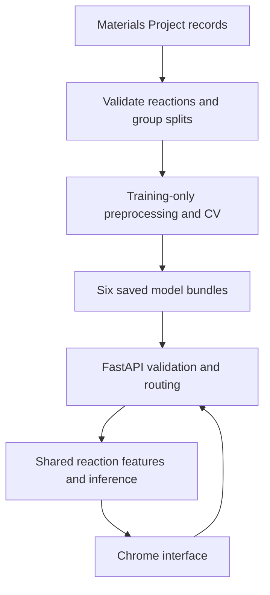

# Battery Electrode Voltage Prediction System

This is the consolidated run, verification and demonstration guide for the
completed nine-step implementation. The application predicts average insertion
voltage from two endpoint compositions and their crystal symmetry using saved
DNN, SVR or KRR models. It runs locally in Chrome through FastAPI.

## Step 9: Final verification

### Install the final addon

Extract `battery_voltage_step9_final.zip` and copy its `scripts`, `tests`,
`examples` and `docs` folders, this README, and `start_project.cmd` into:

```text
D:\2-1_Project School\Solution\battery_voltage_step2_windows\battery_voltage_project
```

Merge with your existing folders. The addon adds verification and documentation;
your completed data pipeline, trained models and working interface are required.
There is no dependency upgrade, retraining or API-key entry in this step.

### Run the automated application check

Stop Uvicorn with Ctrl+C to free the memory occupied by its model copies. From
your project folder in PowerShell, run:

```powershell
.\.venv\Scripts\python.exe scripts\step9_verify_project.py
```

The verifier loads your configured models and exercises nine groups of checks:

1. Readiness of all six saved models.
2. Agreement between model catalog, CV selections and default routing.
3. Four browser sections, static assets, JavaScript content types and API schema.
4. FePO4 example, automatic routing and concentration calculations.
5. Finite inference from each of the six selected models.
6. Batch order and agreement with individual predictions.
7. API CSV download and agreement with JSON values.
8. A two-interval carbon profile using endpoint descriptions from the dataset.
9. Rejection of invalid host, symmetry, concentration, empty batch and reversed profile inputs.

Expected ending:

```text
Report: ...\reports\step9_<timestamp>_<identifier>\step9_report.json
STEP 9 AUTOMATED APPLICATION CHECK PASSED
Complete the three Chrome checks in README_COMPLETE.md; no model was trained.
```

Each invocation writes a new report directory containing JSON and Markdown.
The report records the active run, runtime, actual inference results and saved
evaluation catalog. It does not overwrite previous reports or rerun research
evaluation. A failed check produces a nonzero exit code and no success marker.

Optional: copy your downloaded `voltage_single_results.csv` into the project
folder and use the command below instead. It adds a tenth check comparing the
exported default FePO4 example with the active API:

```powershell
.\.venv\Scripts\python.exe scripts\step9_verify_project.py --export-csv .\voltage_single_results.csv
```

Use the default FePO4 example with both space groups 62 and Automatic model
settings. A file from a different run or model should fail this comparison.
CSV exports preserve voltage precision but omit endpoint space groups, so this
optional comparison is deliberately limited to the documented example. Preserve
the original input description when archiving other prediction results.

### Start the application

From PowerShell:

```powershell
.\start_project.cmd
```

You can also double-click `start_project.cmd` in File Explorer. It uses the
project's Python environment and works when the project path contains spaces.
After `Application startup complete`, open **http://127.0.0.1:8000** in Chrome.
Keep the server window open while using the app.

The equivalent direct command remains:

```powershell
.\.venv\Scripts\python.exe -m uvicorn app.main:app --host 127.0.0.1 --port 8000
```

### Complete three short Chrome checks

The automated verifier exercises the API and serves assets through FastAPI's
test client. It does not click Chrome or prove that a chart rendered. Complete
these three checks on your Windows installation:

| Check | Action | Expected behavior |
|---|---|---|
| Batch | Open Batch predictions. Upload `examples\step9_batch_inputs.csv`, predict and download results. | Two carbon reactions appear in input order; the CSV contains their actual predictions and model/run identifiers. |
| Profile | Open Voltage profile and enter the three states below, selecting Li and Automatic model settings. | Two horizontal interval segments and two table rows appear; the interval CSV downloads. |
| Model results | Open Model results. | Six model rows, two CV-choice badges and the saved evaluation metrics appear. |

For the carbon profile, enter:

| Endpoint | Formula | Space group | Derived crystal system | Li atoms per reduced C host |
|---|---|---:|---|---:|
| 1 | C | 191 | Hexagonal | 0 |
| 2 | LiC12 | 191 | Hexagonal | 1/12 = 0.083333… |
| 3 | LiC6 | 191 | Hexagonal | 1/6 = 0.166667… |

These are endpoint descriptions copied from one multi-step electrode in your
downloaded dataset. They belong to the Li-only development partition, so the
demo is not an unseen-material accuracy test. The material IDs, row identifiers
and source information are in `examples/step9_carbon_provenance.json`. Symmetry
values apply to those dataset entries, not every possible carbon/LiC12/LiC6 phase.

The reduced non-working-ion host here is **C**, not C6. Consequently the chart
axis runs from 0 to 1/6 Li per C. Each segment is an average voltage over one
interval. Its shape is not constrained to decrease and no voltage is clipped.
Your model supplies the two voltages; this guide does not prescribe expected
values for them.

The same intervals are supplied as an API body in
`examples/step9_carbon_profile.json`, for use with POST `/predict/profile`.

After the automated check and these three browser checks pass, all nine
implementation steps are complete. Keep the final report with your project.

## What has already been demonstrated on your computer

Your screenshot and uploaded browser CSV agree on:

| Item | Observed value |
|---|---|
| Active run | `step6_b8e6065bfc4e` |
| Reaction | FePO4 -> LiFePO4 |
| Working ion | Li |
| Endpoint space groups shown in the browser | 62 and 62 |
| Displayed voltage | 3.465 V |
| Full exported voltage | 3.4650564309719782 V |
| Model | Li-only DNN, `dnn_scaled_0` |
| Insertion interval | 0 -> 1 Li per reduced FePO4 host |
| Discharged Li atom fraction | 1/7 = 0.14285714285714285 |
| Reference Li-only grouped holdout MAE | 0.787205717223363 V |
| Transfer flag | False: Li is included in the model's training ions |
| Changed training-constant features | 0 for this request |

This establishes that the browser, API, model inference and single-result export
worked for this input. It does not establish a 0.787 V error bound around this
prediction, nor an experimental voltage measurement.

## Daily operation

1. Start `start_project.cmd`.
2. Open Chrome at `http://127.0.0.1:8000` and wait for **6 models ready**.
3. Enter both endpoint formulas and their known space groups.
4. Predict and inspect the model identity, loading interval and notices.
5. Save the input description together with downloaded results.
6. Stop the server with Ctrl+C when finished.

The default model family is the family chosen by development CV. The default
population routing is:

| Requested working ion | Training population |
|---|---|
| Li, Na, K | Li only |
| Mg, Ca, Zn, Al, Y | Mixed ions |

Na and K are absent from both training populations. Their predictions use
transfer without fine-tuning. The interface labels this condition. Researchers
can explicitly select model family or population without changing the recorded
default selection.

## Architecture and implementation map



| Location | Role |
|---|---|
| `src/data/mp_download.py`, `recovery.py`, `inspection.py` | Collect and inspect electrode/symmetry records; recover partial metadata downloads. |
| `src/data/chemistry.py`, `preparation.py` | Validate formulas, concentrations, shared hosts, symmetry and grouped splits. |
| `src/features/reaction_features.py` | Generate the fixed 740-feature representation for training and inference. |
| `src/features/preprocessing.py` | Fit and persist constant-column removal, scaling and optional PCA on the permitted training partition. |
| `src/training/experiment.py`, `voltage_models.py` | Train CV candidates, freeze model choices, fit final models and evaluate reserved sets. |
| `src/inference/bundle.py`, `registry.py` | Load verified bundles and the active run; route requests and execute inference. |
| `app/schemas.py`, `main.py` | Validate API requests; expose prediction, batch, profile, model and status routes. |
| `frontend/index.html`, `frontend/assets/` | Browser forms, validation messages, CSV handling, chart and model-results table. |
| `scripts/` | Command-line entry points for each implementation stage. |
| `config/active_model.json` | Identifies the currently served training run and its recorded manifest checksum. |
| `models/<population>/<step6_run>/<family>/` | Selected estimator and preprocessing bundles. |
| `reports/`, `data/raw/`, `data/splits/`, `data/features/` | Provenance, evaluation, original downloads and prepared datasets. |

There is no database server, user-account system, paid inference service or
separate frontend build process in this local implementation. Materials Project
access is needed when collecting new data; saved-model inference runs locally.

## Software and hardware

The verified user setup is Windows 11, 64-bit Python 3.11.9, a project `.venv`
and Google Chrome. Direct dependency versions are in `requirements.txt`; your
full installed environment should be preserved in `requirements-lock.txt`.

Core packages include NumPy 2.1.3, pandas 2.2.3, SciPy 1.15.3, scikit-learn 1.6.1,
TensorFlow 2.20.0, FastAPI 0.115.12, Uvicorn 0.34.3 and HTTPX 0.28.1. The current
implementation uses HTTPX for Materials Project access and its own documented
composition parser; the initially discussed mp-api/pymatgen packages were not
needed for this version.

CPU inference is sufficient for this application. About 8 GB RAM is a practical
starting point and 16 GB is more comfortable for development and training;
these are engineering estimates rather than measured minimum requirements.
Keep adequate space for the Python environment, raw snapshots and training
artifacts. GPU execution is not part of this native Windows setup.

For an already completed project, do not recreate the environment or reinstall
packages each time you launch the server. On a new machine, follow
`README_SETUP.md` for Python 3.11 and the initial virtual environment, then restore
your source, data, reports and saved models. Use your recorded compatible lock
file when restoring the same Windows environment.

## Dataset and learning protocol

The recovered snapshot contains 6,683 electrode documents and 7,461 adjacent
intervals. Step 4 retained 7,419 intervals and quarantined 42 with incomplete
required inputs. Overall-electrode summaries and adjacent intervals overlap;
they are not concatenated as independent examples.

| Population / evaluation set | Intervals |
|---|---:|
| Mixed-ion development | 6,140 |
| Mixed-ion holdout | 630 |
| Li-only development | 3,021 |
| Li-only holdout | 324 |
| Held-out Na | 472 |
| Held-out K | 177 |

Li-only data are a subset of mixed-ion chemistry; these rows must not be summed
as independent additional observations. The reported Step 4 checks found zero
group, source-record, endpoint and host overlap across the respective holdout
and CV partitions. Held-out-ion evaluation is a separate setting: Na/K may
include host groups also represented in development, and the reports separate
known/new groups where available.

The 740 raw columns comprise endpoint element fractions (236), endpoint
composition summaries (14), working-ion indicators/properties (10), interval
concentrations/loadings (6), endpoint crystal-system indicators (14), and
endpoint space-group indicators (460). Targets, source IDs, split IDs and review
flags are excluded from predictors.

Step 5 fitted separate preprocessing for all ten CV training partitions and
for the final development data. Eighty-component PCA retained approximately
43.15% and 51.53% of standardized feature variance in the complete mixed/Li-only
development sets. Those percentages are not prediction accuracy.

Step 6 compared both PCA and scaled features without PCA. It selected six
candidates using development CV, then trained and evaluated the frozen choices.
All six selected candidates in your completed run use scaled features without
PCA. Constant-column removal leaves 497 final mixed-ion inputs and 431 final
Li-only inputs. The DNN therefore uses the actual selected input width rather
than an unconditional 80-input layer.

The DNN uses hidden layers of 60 and 30 ReLU units, dropout 0.25 and 0.10, L2
regularization and a linear voltage output. The saved model reverses its target
standardization. SVR and KRR use RBF kernels, with their selected settings stored
in the bundles. Full training settings and adaptation choices are documented in
`README_STEP6.md` and the completed training report.

## Your recorded model results

These are the values reported by your Windows training run, in volts:

| Population | Family | Holdout MAE | Na MAE | K MAE |
|---|---|---:|---:|---:|
| Mixed ions | SVR | 0.6973 | 0.9115 | 1.3500 |
| Mixed ions | KRR | 0.8126 | 0.9973 | 1.4287 |
| Mixed ions | DNN | 0.6553 | 0.7431 | 1.2093 |
| Li only | SVR | 0.7802 | 0.9587 | 1.2083 |
| Li only | KRR | 0.8602 | 1.0010 | 1.2907 |
| Li only | DNN | 0.7872 | 0.9240 | 1.0039 |

Development CV selected DNN for both populations. Li-only SVR has a slightly
smaller observed holdout MAE, but the final test does not replace the CV-based
default. The two populations have different holdout sets, so their overall
holdout MAEs are not a comparison on identical lithium test examples.

The app reads full metrics and baseline results from your saved report. It does
not embed this rounded table as the source of prediction/evaluation values.
Consult `reports/step6_b8e6065bfc4e/step6_report.json` for the complete results.

## Research limits to state in a presentation

- Labels are computed insertion voltages, not experimental measurements.
- This is a current-database adaptation, not an exact reproduction of the
  original paper's dataset, 237-feature encoding or all hyperparameters.
- The representation uses composition and symmetry; it does not include atomic
  coordinates or a graph model.
- No calibrated per-prediction uncertainty is available. MAE is a dataset average.
- Na/K evaluation uses held-out ions from the same source database, not an
  independent experimental benchmark.
- Negative and extreme voltages were retained and flagged. Fourteen priority
  label reviews remain unresolved; reference-energy/provenance review is still
  research work, even when the software checks pass.
- The recovered symmetry metadata were fetched after the original electrode
  records. Database-version continuity across that recovery was not certified.
- Formula and symmetry checks do not establish whether a proposed phase is
  stable or experimentally accessible.

The defensible project outcome is a working, traceable local voltage-screening
prototype with grouped model evaluation and explicit transfer notices. Research
improvements should be assessed with a new predefined evaluation plan rather
than repeated tuning against the existing final holdouts.

## Testing evidence and demonstration

The previous interface package passed 22 API tests, 12 JavaScript tests and 16
headless Chromium browser checks. The five new Step 9 tests passed using actual
estimators fitted to temporary synthetic software-test data. They verify that
missing models, corrupt exports and reordered batch responses cannot silently
produce a successful acceptance report, and that fixture reports are labelled
synthetic. These local Linux tests do not substitute for the Windows command
and Chrome checks above.

You can rerun the new verifier tests when changing its code:

```powershell
.\.venv\Scripts\python.exe -m unittest discover -s tests -p "test_step9_acceptance.py" -v
```

Expected: `Ran 5 tests` and `OK`. Deliberate `[ERROR]` messages inside these
tests demonstrate failure handling; the unittest result determines whether a
test passed. Running the tests creates only temporary synthetic model bundles,
not new research models. Routine daily startup does not require rerunning tests.

For a five-minute project demonstration:

1. Explain that an input is an insertion interval, using FePO4 -> LiFePO4.
2. Show a single prediction, model identity, concentration calculation and MAE context.
3. Upload the two-row carbon CSV and download results.
4. Enter the three carbon states and explain interval averages and the reduced-host axis.
5. Show the six-model results, explain CV selection and state the research limits.

## Backup and troubleshooting

Preserve the source, `requirements.txt`, your Windows `requirements-lock.txt`,
`config`, `models`, `reports`, `data`, `examples` and this documentation together.
For faithful reproducibility, keep the complete active Step 4/5/6 records and
bundles. Copying only neural-network weights omits necessary preprocessing and
provenance. Recreate `.venv` from the compatible dependency record when moving
to a new machine rather than copying the virtual environment itself.

| Problem | Resolution |
|---|---|
| The Python command uses 3.13 | Use `.\.venv\Scripts\python.exe` or the supplied launcher. Your project uses Python 3.11. |
| The server cannot bind port 8000 | Stop the other Uvicorn process or choose `--port 8001` and open that port in Chrome. |
| Models are not ready | Inspect the server error and confirm the configured completed run and bundle files are present. |
| Active configuration is missing after copying the project | Run `scripts\step7_configure_api.py --step6-run step6_b8e6065bfc4e` with the project Python. |
| A checksum/schema error occurs | Restore matching source, report and bundle files from the completed run. Do not edit checksums to bypass it. |
| The browser shows an older page | Restart Uvicorn from the correct project folder and press Ctrl+F5. |
| The profile is rejected | Check common host, increasing contiguous loading and matching symmetry at shared endpoints. Use the documented carbon example for a functional check. |
| An exported voltage differs slightly from the display | The page rounds to three decimals; the export retains the full API number. |
| Step 9 succeeds but a browser workflow fails | The script does not execute Chrome. Share the browser error and server message for that workflow. |

Implementation completion and scientific validation are separate milestones.
When Step 9 and the three browser checks pass, the planned software build is
complete; improvements to model quality or research claims are subsequent work.
